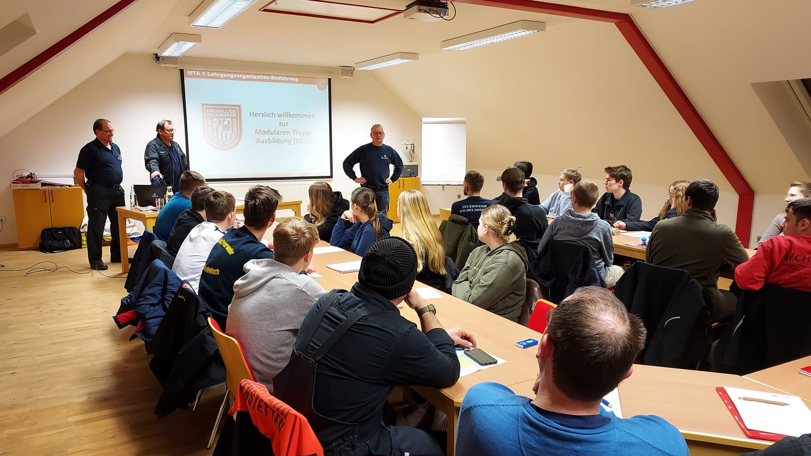
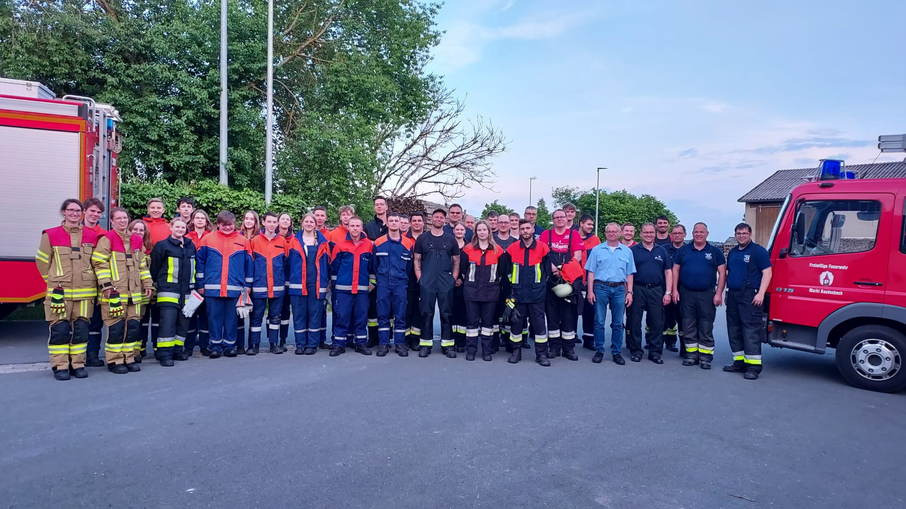

# Modulare Truppausbildung MTA in Baudenbach

{ width="400"; loading=lazy }

Im Feuerwehrhaus Baudenbach war in diesem Frühjahr viel los. 28 junge Feuerwehrfrauen und -männer aus 6 Feuerwehren, darunter 10 Frauen und Männer aus Baudenbach absolvierten Ihren Grundlehrgang MTA.

<!-- more -->

An insgesamt 17 Abenden und Samstagen absolvierten sie den 80 UE umfassenden Unterricht. In diesen Einheiten wurde Ihnen in Theorie und an vielen Praxiseinheiten die Grundlage vermittelt, die ein jeder Feuerwehrmann/Frau braucht, um später erfolgreich an Einsätzen teilnehmen zu können. Am gestrigen Abend konnten alle 28 Teilnehmer/innen den Grundlehrgang erfolgreich abschließen. Jetzt folgt eine ca. 2jährige Ausbildung in den jeweiligen Feuerwehren, dann können Sie alle die MTA Abschlussprüfung machen und mit dieser Prüfung an Lehrgängen in der Feuerwehrschule teilnehmen.

Vielen Dank an das Ausbildungsteam der Kreisinspektion, sowie vor allem auch an die Praxisteams aus Neustadt/Aisch, Diespeck, Dachsbach, Uehlfeld, Wilhelmsdorf, Markt Erlbach, Emskirchen und Baudenbach.

Erfolgreiche Teilnehmer aus Baudenbach waren:

* Lea Bärthlein
* Finja Bärthlein
* Johannes Hofmann
* Nils Hofmann
* Anna-Marie Kestler
* Pauline Kestler
* Christian Meyer
* Florian Peter
* Paul Rummel
* Jonas Tratz

Bilder: Werner Weglehner

Bericht: Karl-Heinz Köberer

{ width="400"; loading=lazy }
