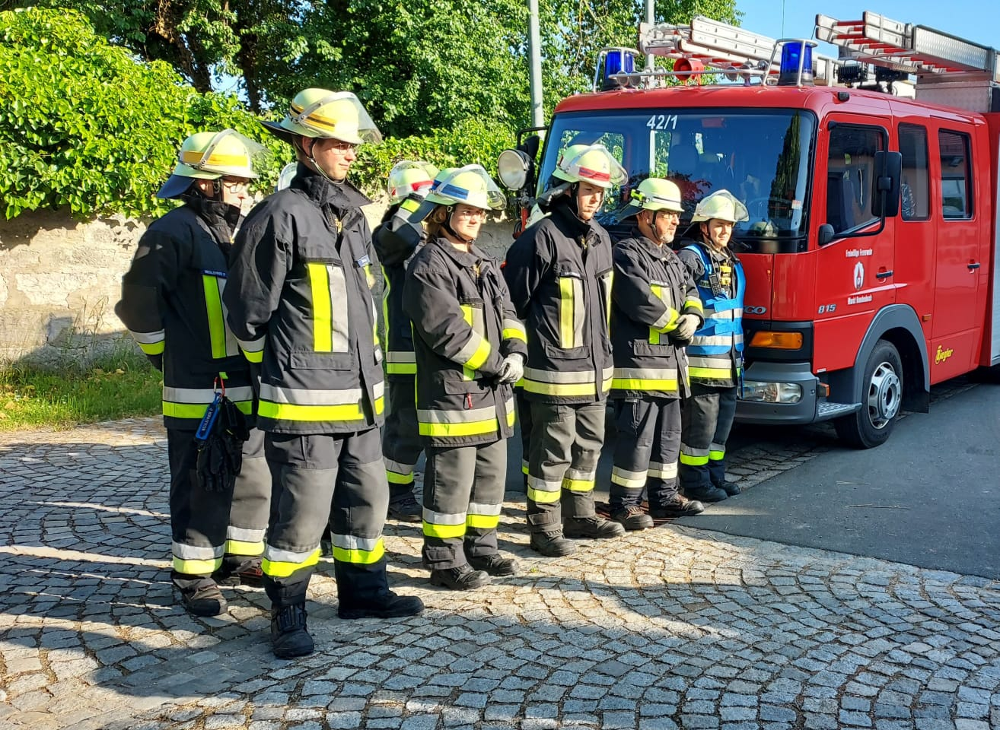
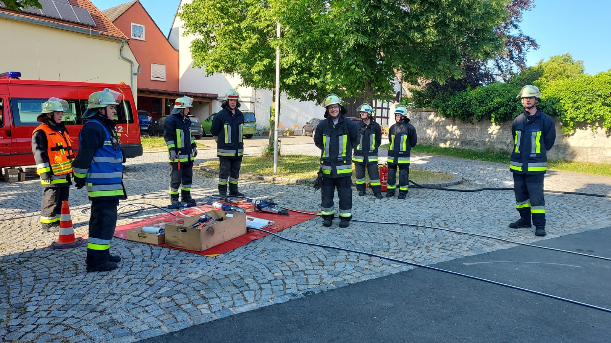
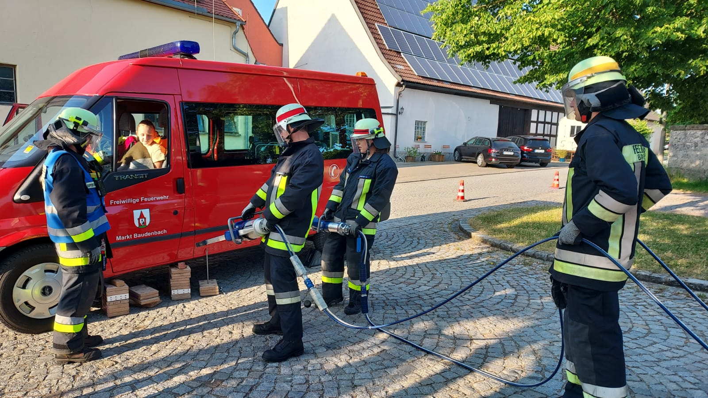
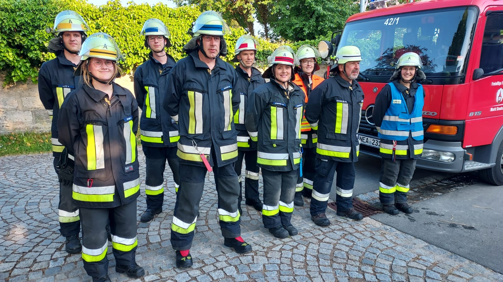

# Erfolgreiche THL Leistungsprüfungen mit Frauenpower

{ width="400"; loading=lazy }

Am Freitag, den 02.06.2023 legten 2 Teams der Feuerwehr Baudenbach, begutachtet von dem Schiedsrichtertrio KBI Dieter Popp, KBM Florian Sacher und KBM Karl-Heinz Köberer, erfolgreich die Leistungsprüfung THL ab.

<!-- more -->

Unter der Führung unserer Gruppenführerinnen Carina Köberer und Christina Weglehner konnten die gestellten Einzel-, Truppaufgaben, sowie der Aufbau der Leistungsprüfung fehlerfrei vorgeführt werden.

Bronze Gruppe mit der Gruppenführerin Carina Köberer, Maschinist Mario Schulze, Max Sandmann, Marvin Sandmann, Sarah Schmidt, Hanna Bärthlein, Florian Peter, Philipp Weglehner und Maria Hudezeck.

Gemischte Gruppe mit der Gruppenführerin Christina Weglehner, Markus Meyer, Wolfgang Hofmann, Stefan Lutz, sowie den Ergänzern Mario Schulze, Carina Köberer, Sarah Schmidt, Philipp Weglehner und Florian Peter.

Bilder: Werner Weglehner

Bericht: Karl-Heinz Köberer

{ width="400"; loading=lazy }
{ width="400"; loading=lazy }
{ width="400"; loading=lazy }
