# Deutsche Jugendleistungsspange

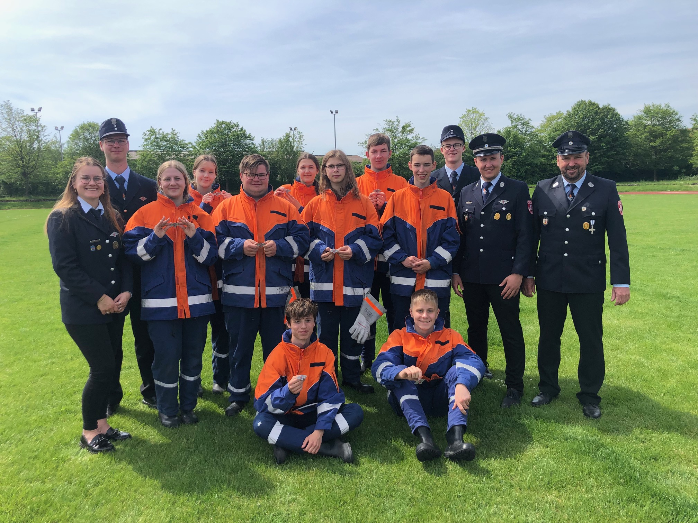{ width="400"; loading=lazy }

Am heutigen Samstag legten insgesamt 4 Gruppen aus dem Landkreis das höchste Jugendleistungsabzeichen ab, die Deutsche Jugendleistungsspange.

<!-- more -->

Als einziges Team konnte die Feuerwehr Baudenbach eine gesamte Gruppe stellen, die anderen drei Teams bestanden aus Mischgruppen von 2 oder 3 Feuerwehren.

Unser erfolgreiches Team trat in folgender Besetzung an:

* Finia Bärthlein
* Lea Bärthlein
* Pauline Kestler
* Johannes Hofmann
* Christian Meyer
* Selian Penhuet
* Paul Rummel
* Michael Schmidt
* Jonas Tratz

Vielen Dank an Euch für die starke Leistung, ebenso gilt unser Dank den Betreuern, Werner Weglehner, Johannes Weglehner, Philipp Graf, Florian Peter und Sarah Schmidt.

Bericht: Karl-Heinz Köberer  
Bilder: Karl-Heinz Köberer und Werner Weglehner

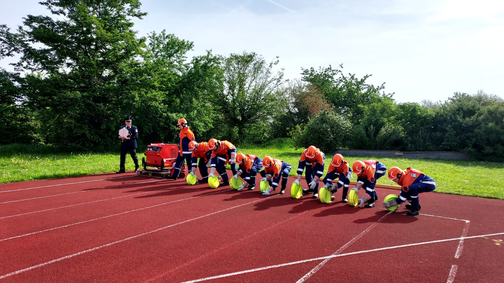{ align=left; width="400"; loading=lazy }
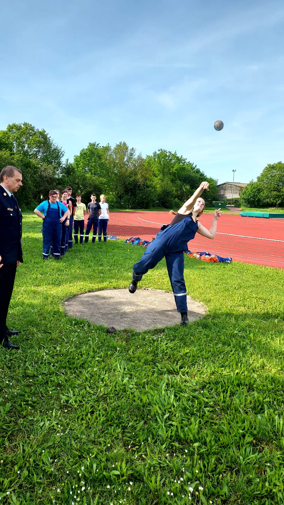{ align=left; width="400"; loading=lazy }
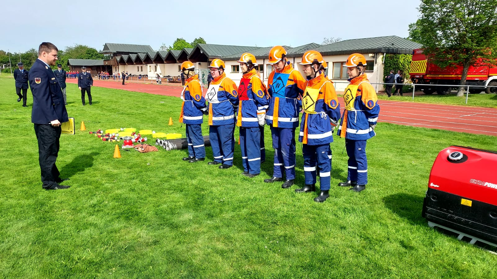{ align=left; width="400"; loading=lazy }
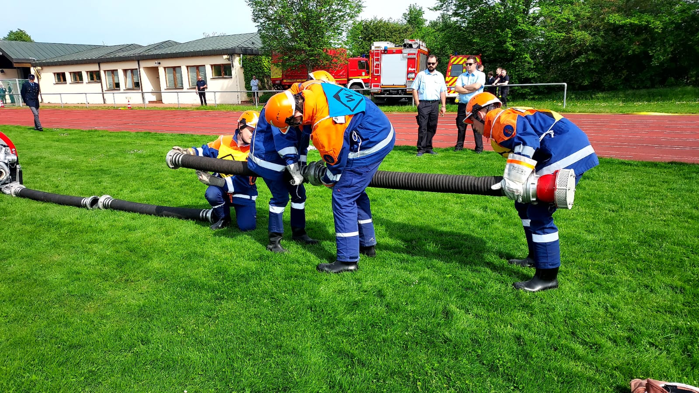{ align=left; width="400"; loading=lazy }
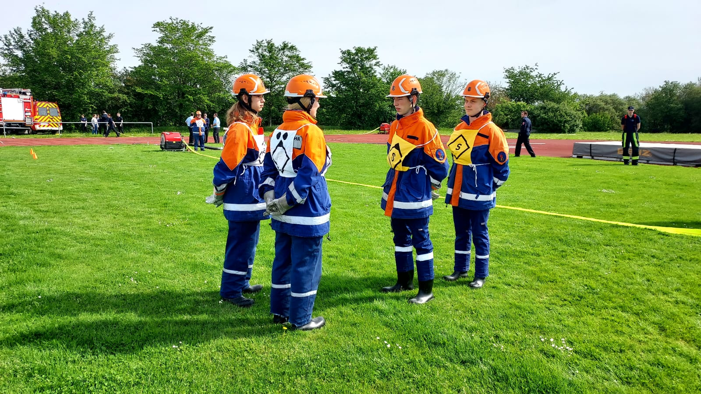{ align=left; width="400"; loading=lazy }
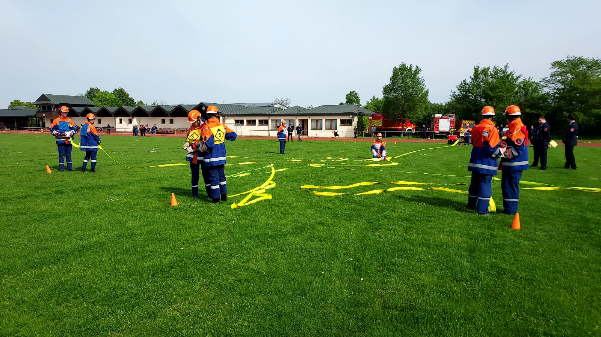{ align=left; width="400"; loading=lazy }
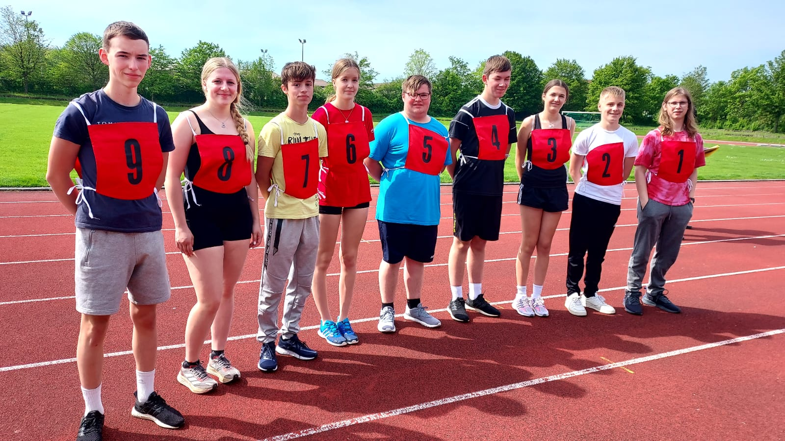{ align=left; width="400"; loading=lazy }
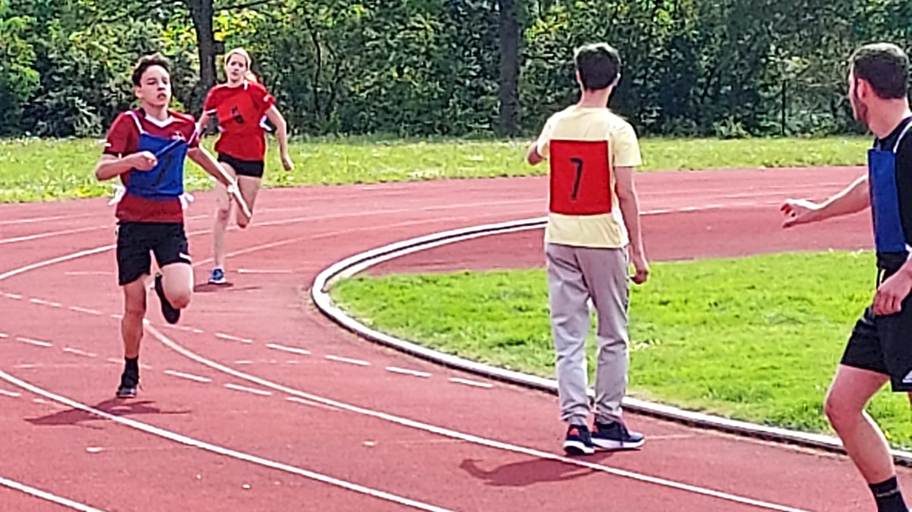{ align=left; width="400"; loading=lazy }
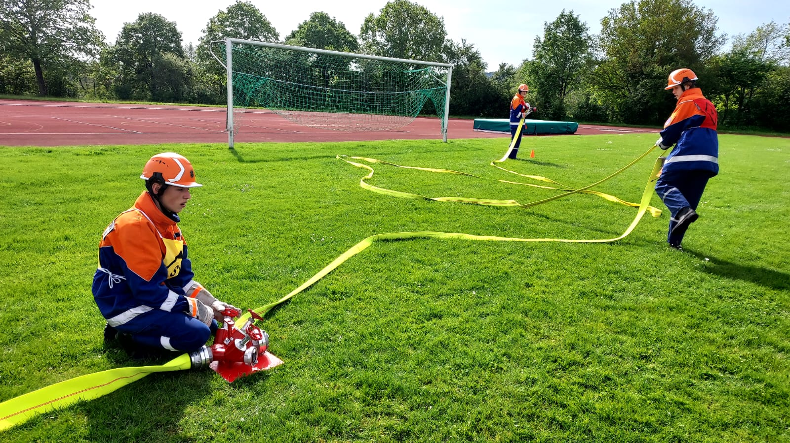{ align=left; width="400"; loading=lazy }
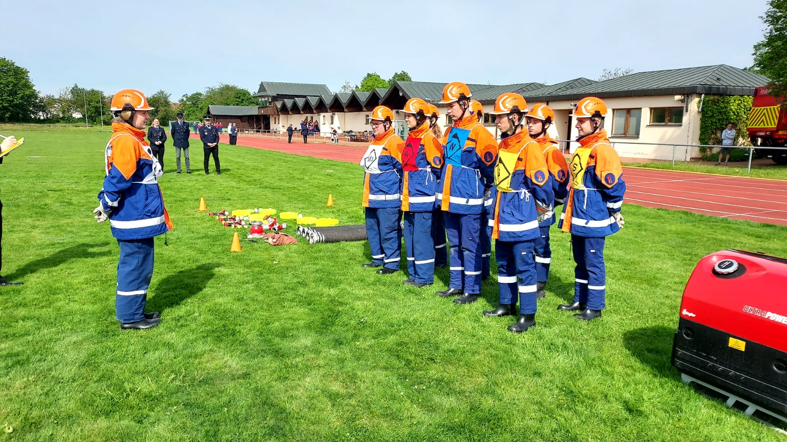{ align=left; width="400"; loading=lazy }