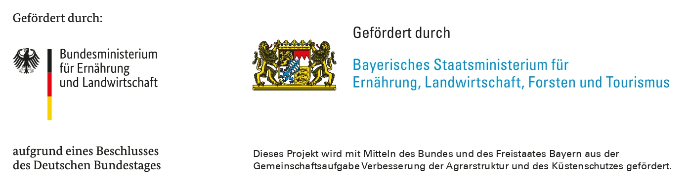
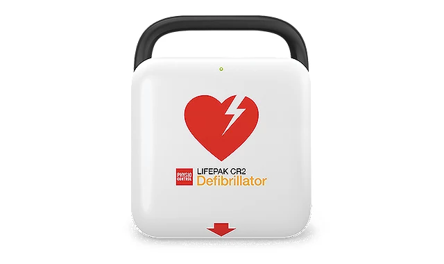

# Anschaffung Defibrillator

{ width="700"; loading=lazy }

Dank Unterstützung aus dem [Regionalbudget](https://neustadtundland.de/regionalbudget) konnte für die Feuerwehr Baudenbach
ein Defibrillator angeschafft werden. Dieser ist auf dem Einsatzfahrzeug verlastet und steht damit im Notfall
allen Bürgern zur Verfügung.

Gefördert wurden 80% der Anschaffungskosten, die restlichen Kosten übernimmt der Verein.

<!-- more -->

## Besonderheiten

* Spezieller Kindermodus (bis 8 Jahre/25 kg)
* WLAN-Konnektivität, dadurch vollautomatische Überprüfung der Einsatzbereitschaft mit Notifizierung

{ width="700"; loading=lazy }

