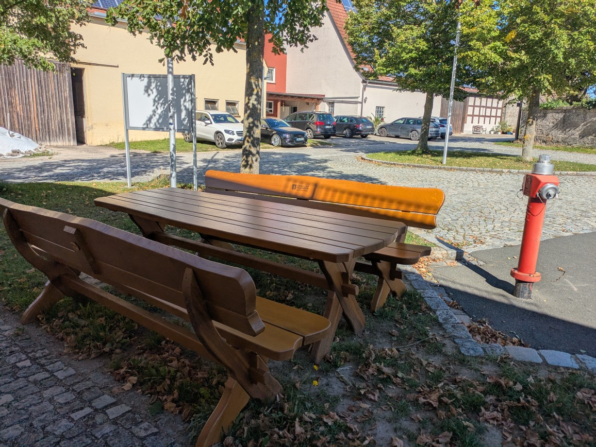
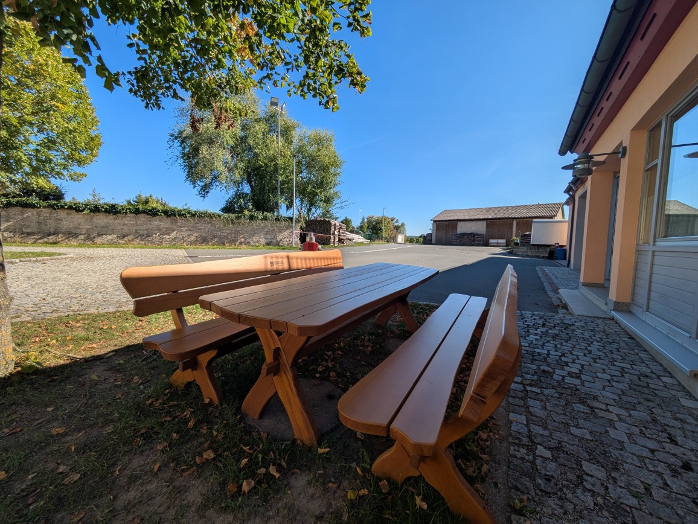
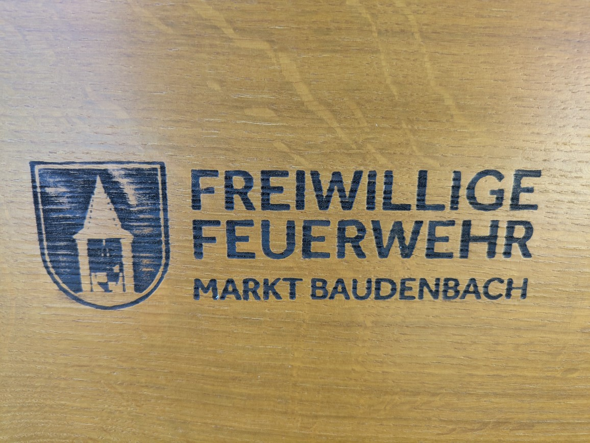

# Anschaffung Sitzgelegenheit

{ width="150"; loading=lazy } **LAG Südlicher Steigerwald**

Dank Unterstützung aus dem [LEADER-Förderprogramm](https://lag-steigerwald.jimdofree.com/leader-f%C3%B6rderung/unterst%C3%BCtzung-b%C3%BCrgerengagement/) der _**L**okalen **A**ktions**G**ruppe Südlicher Steigerwald_ konnte für die Feuerwehr Baudenbach
eine neue Sitzgelegenheit (zwei Bänke und Tisch) angeschafft werden. 

Diese steht nun vor unserem Feuerwehrhaus. In naher Zukunft wird der Untergrund noch befestigt.

Diese Sitzgelegenheit dient der Förderung der Kameradschaft, steht aber natürlich allen Bürgern und Radfahrern des vorbeiführenden Radweges offen.  

Kosten, die über die Förderhöhe hinaus gehen übernimmt der Feuerwehrverein.

Die Freiwillige Feuerwehr bedankt sich herzlich für die Unterstützung!

<!-- more -->

## Bilder

{ align=left; width="400"; loading=lazy }
{ align=left; width="400"; loading=lazy }
{ align=left; width="400"; loading=lazy }