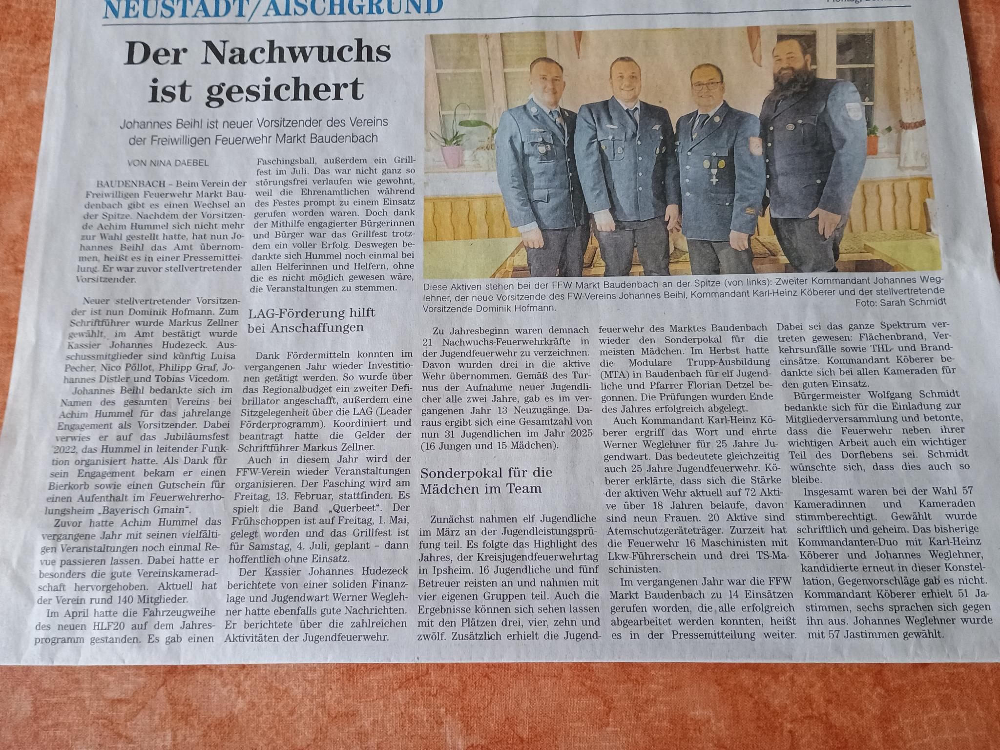

# Neuwahlen bei der Feuerwehr Baudenbach

{ align=right; width="500"; loading=lazy }

Am 17. Januar 2026 fand die diesjährige Dienstversammlung der Freiwilligen Feuerwehr sowie die Mitgliederversammlung des Feuerwehrvereins statt.

Turnusgemäß fanden hier Neuwahlen für die Kommandanten und die gesamte Vereinsführung statt.

<!-- more -->

Als Kommandant wurden Karl-Heinz Köberer und Johannes Weglehner als Stellvertreter im Amt bestätigt.

Beim Verein trat der bisherige Vorstand Achim Hummel nicht mehr an. 

Johannes Beihl bedankte sich bei Achim Hummel für die geleistete Arbeit. Er hat den Verein stark vorangebracht und ohne ihn wäre ein Fest wie unseres nicht möglich gewesen.

Ergebnis der Wahl:

- Vorstand: Johannes Beihl
- Stv. Vorstand: Dominik Hofmann
- Schriftführer: Markus Zellner
- Kassier: Johannes Hudezeck
- Beisitzer: Luisa Pecher, Nico Pöllot, Philipp Graf, Tobias Vicedom, Johannes Distler
- Kassenprüfer: Markus Meyer und Harald Beihl

## Zeitungsbericht

{ align=left; width="400"; loading=lazy }
